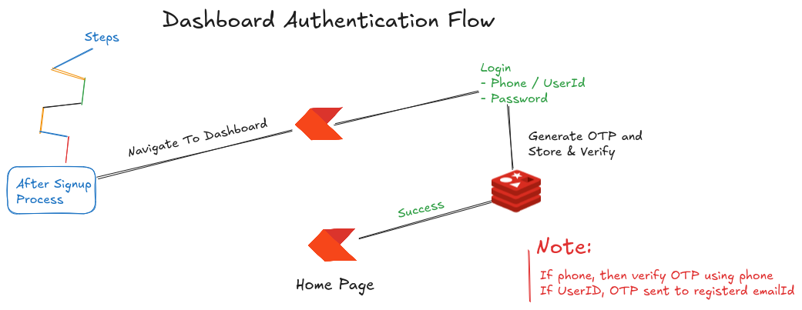
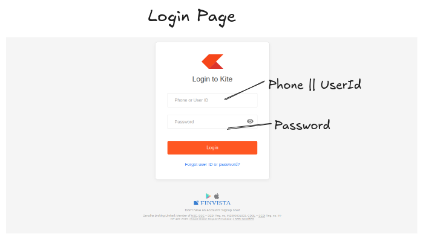
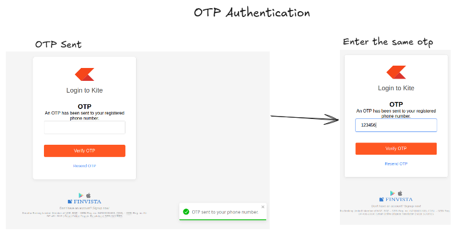
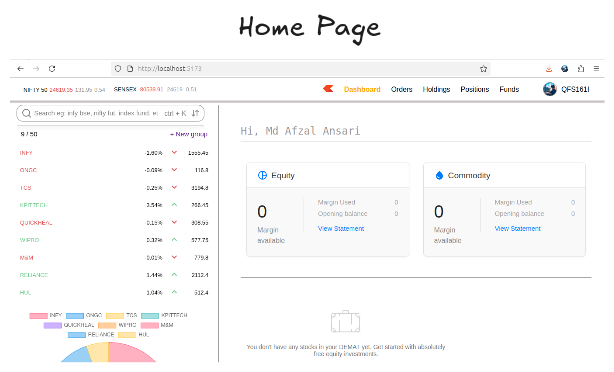
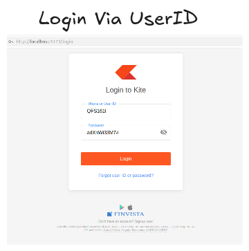
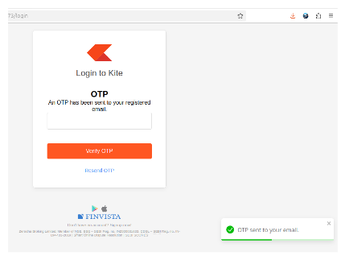
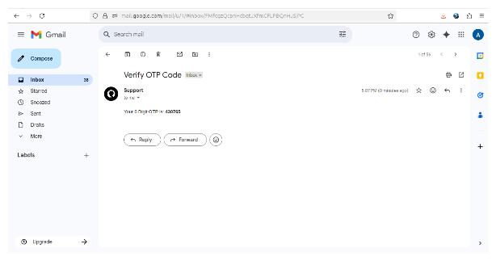
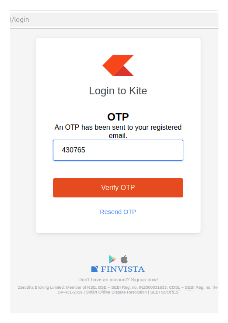

# FinVista Dashboard (kite) 📊  

Welcome to the **FinVista Dashboard** — the **heart of the FinVista trading ecosystem**.  

This is where **authenticated users** step into a **realistic, modern, and interactive trading environment**.  

Designed with **scalability**, **performance**, and **user experience** in mind, the dashboard offers:  

-   ✨ **Real-time stock tracking**
-   📈 **Interactive charts & analytics**
-   🧩 **Personalized watchlists**
-   🔐 **Secure profile management**  

Think of this as your **command center for trading** — blending **clean UI** with **powerful functionality**.  

**Live Demo** : [FinVista Trading Dashboard](https://finvista-trading-dashboard.onrender.com)  

---   

## Table of Contents

-   **[Overview](#-overview)**
-   **[Key Features](#-key-features)**
-   **[Dashboard Workflow](#-dashboard-workflow)**
-   **[Tech Stack](#-tech-stack--skills)**
-   **[Project Structure](#-project-structure)**
-   **[Getting Started](#-getting-started)**
-   **[Backend Repository](#️-backend-repository)**
-   **[Authentication Flow](#-authentication-flow)**
-   **[Login Flow](#-login-dashboard)**

--- 

### 📌 Overview  

The **FinVista Dashboard** focuses on delivering a **realistic trading environment** with: 

-   **Real time market updates :** _Users are able to search stocks & they can buy, also check holdings and orders, in table format as well as in charts_  
-   **Interactive charts** _for stock analysis_
-   **User-specific data management (watchlists)**

This project demonstrates **advanced state management**, **secure API integrations**, and **modular component design** that make the dashboard highly **scalable** and **maintainable**.  

### ✨ Key Features  

-   **Stock Search & Orders** – _Quickly search scrips and simulate buy/sell orders_.  

-   **Real-Time Updates** – _**Market prices** are fetched **dynamically**, giving a **live trading feel**._
  
-   **Interactive Charts** – _Visual insights into stock performance using charting libraries_.  

-   **User Profile & Settings** – _Manage profile details, update password, and configure account preferences._  

-   **Secure Sessions** – _JWT-based authentication ensures a safe and reliable user experience._  


### 🔄 Dashboard Workflow

___Once logged in, the user can:___
1. **Search Stocks →** _Find real-time prices of desired stocks_.
2. **Analyze Performance →** _Use charting tools to study trends and take informed actions._
3. **Simulate Orders →** _Experience a near real-time order placement environment._
4. **Profile Management →** _Update settings like password, skills, or availability (connected with backend)._  

### 💻 Tech Stack / Skills   

**Frontend (Dashboard)**
-   **ReactJS** _(Component-based UI)_
-   **Redux Toolkit** _(State management for authentication, watchlist, and stock data)_
-   **Tailwind CSS** _(Utility-first styling)_
-   **Chart.js** _(Interactive stock charts)_
-   **Axios** _(API communication with backend)_  

**Backend (Shared)**  
-   **Node.js + Express.js**
-   **MongoDB + Mongoose**
-   **Firebase Authentication (OTP Verification)**
-   **Redis (Caching sessions & OTPs)**


### 📂 Project Structure  
```
📁 trading-dashboard
├── 📘 docs                # Documentation & guides
├── 📦 node_modules        # Project dependencies
├── 🌐 public              # Static assets (icons, images, etc.)
├── 💻 src                 # Core application source code
│   ├── 🔌 api             # API calls & backend integration
│   ├── 📊 charts          # Stock charts & analytics components
│   ├── 🧩 Components      # Reusable UI components
│   ├── 🗂️ data            # Static data, mock files, constants
│   ├── 🎣 hooks           # Custom React hooks
│   ├── 📄 Pages           # Page-level components (Dashboard, Profile, etc.)
│   ├── ⚙️ App.jsx         # Root application component
│   ├── 🔥 firebase.js     # Firebase configuration
│   ├── 🎨 index.css       # Global styles
│   ├── 🏁 main.jsx        # Application entry point
│   └── 🚧 PathNotFound.jsx# 404 page handler
├── ⚙️ .env                # Environment variables
├── 📑 .gitignore          # Git ignore rules
├── 📝 README.md           # Project documentation
├── 🛠️ vite.config.js      # Vite configuration
├── 📦 package.json        # NPM dependencies & scripts
└── 📦 package-lock.json   # Dependency lock file
```

### 🚀 Getting Started  
1. **Clone the Repository**  
```
git clone https://github.com/Afzal14786/trading-dashboard.git
cd trading-dashboard
```

2. **Install Dependencies**
```
npm install
```

3. **Environment Variables**
_Create a .env file in root with:_  
```
REACT_APP_BACKEND_URL=<your_backend_url>
REACT_APP_FIREBASE_API_KEY=your_api_key
```

4. **Run Development Server**  
```
npm run dev
```


### 🛠️ Backend Repository  
_The backend powering this dashboard is located here:_
[Backend Repository](https://github.com/Afzal14786/zerodha-backend.git)  

It handles:
-   **Authentication**
-   **Watchlist CRUD**
-   **Order simulation APIs**
-   **Profile management**
-   **Integration with Firebase + Redis**
-   **MongoDB for storage**  

--- 

### 🔐 Authentication Flow
**The FinVista Dashboard** comes with a **secure** and **user-friendly login system**. Users can access their trading dashboard either via **Phone Number** or **Unique User ID**.  

  

### 📝 Signup (from Landing Page)  
1. Users start at the **[FinVista Landing Page](landing_page_url/signup)**.
2. They create an account by entering basic details (___Name, Email, Phone Number, Password___).  
3. During signup, a **temporary OTP** is used (_as phone billing is currently disabled_).
    - 🔢 There are **10 demo phone numbers** with **pre-mapped OTPs** available in the frontend **[README.md](https://github.com/Afzal14786/Trading-Platform)**.
    - Users can select any of these to create their account.


### 🔑 Login Dashboard  

1. **Login with Phone Number**
    -   Enter **Phone Number + Password**.
    -   A popup appears: ___“OTP sent to your mobile number”___.
    -   Since live phone auth is not enabled, users must use the **same OTP** they used during signup.
    -   After successful OTP verification, the user is redirected to the **Dashboard Home**.  

**Image Suggestion** 📸:



  

2. **Login with User ID**  
-   Enter **7-digit Unique User ID + Password**.
-   A **6-digit OTP** is automatically sent to the user’s **registered email address**.
-   Enter the OTP → upon verification, the user is redirected to the **Dashboard Home**.  

**Image Suggestion** 📸:  





  


--- 

### ⭐ Like This Project?  
_If you enjoy working with this project:_ 
-   Give it a 🌟 star

-   Follow me for more:
    - 🐙[Github](gitub.com/afzal14786)
    - 🔗[Linked In](linkedin.com/in/mdafzal14786)
    - 📸[instagram](instagram.com/mdafzal14786)
    - 🔗[Link Tree](https://linktr.ee/mdafzal14786)  

--- 

Thank you for your support — Happy Coding! 🚀👨‍💻✨